# Flow Control — תרשימים, מבנה נתונים ולוגיקה עסקית

## מסמך טכני-ויזואלי לבניית מערכת מקבילה ב-SAP

---

## תוכן עניינים

1. [מבנה נתונים (ERD)](#1-מבנה-נתונים-erd)
2. [מחזור חיי אצווה (Batch Lifecycle)](#2-מחזור-חיי-אצווה)
3. [תהליך רכש — הזמנה מיידית](#3-תהליך-רכש--הזמנה-מיידית)
4. [תהליך רכש — הזמנת מסגרת ובקשות משיכה](#4-תהליך-רכש--הזמנת-מסגרת-ובקשות-משיכה)
5. [קליטת משלוח (Goods Receipt)](#5-קליטת-משלוח)
6. [הוצאה מהמלאי (Dispensing)](#6-הוצאה-מהמלאי)
7. [פריטים בשימוש והשלכה חלקית](#7-פריטים-בשימוש-והשלכה-חלקית)
8. [ספירת מלאי פיזית](#8-ספירת-מלאי-פיזית)
9. [חישוב השלמות מלאי (Replenishment)](#9-חישוב-השלמות-מלאי)
10. [מנוע התראות](#10-מנוע-התראות)
11. [סטטוס מלאי ריאגנט (Stock Status)](#11-סטטוס-מלאי-ריאגנט)
12. [סקירת מסכים ופעולות](#12-סקירת-מסכים-ופעולות)
13. [משלוחים יוצאים](#13-משלוחים-יוצאים)
14. [בקרת איכות (QC)](#14-בקרת-איכות)
15. [סריקת ברקודים](#15-סריקת-ברקודים)
16. [תנועות מלאי (Inventory Transactions)](#16-תנועות-מלאי)

---

## 1. מבנה נתונים (ERD)

### 1.1 ישויות ליבה — ריאגנטים, ספקים, אצוות

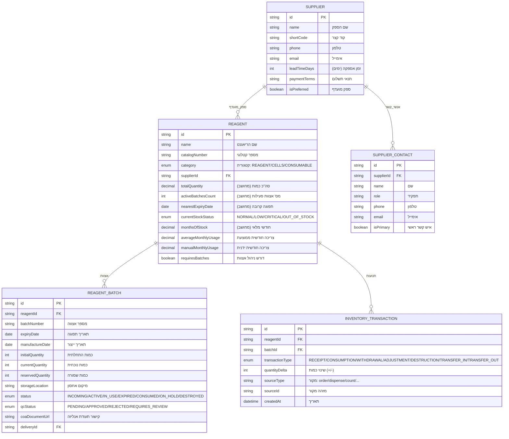

### 1.2 שרשרת רכש — הזמנות, מסגרת, משיכות

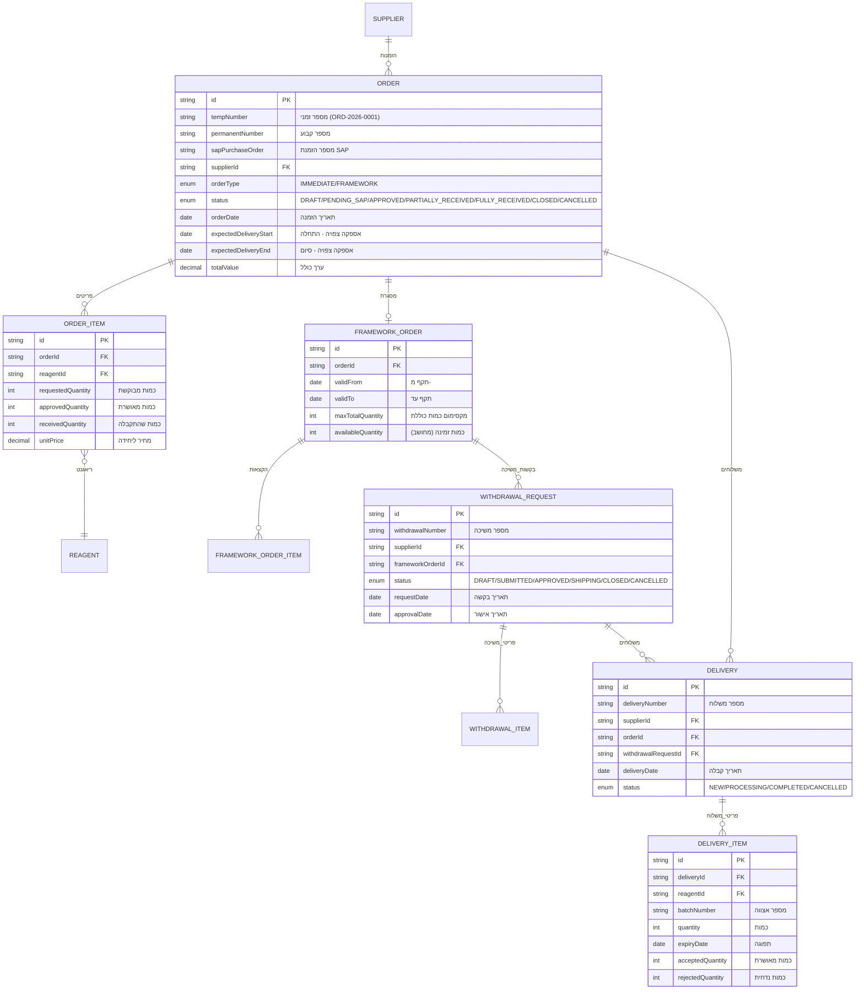

### 1.3 הוצאה, שימוש, השלכה

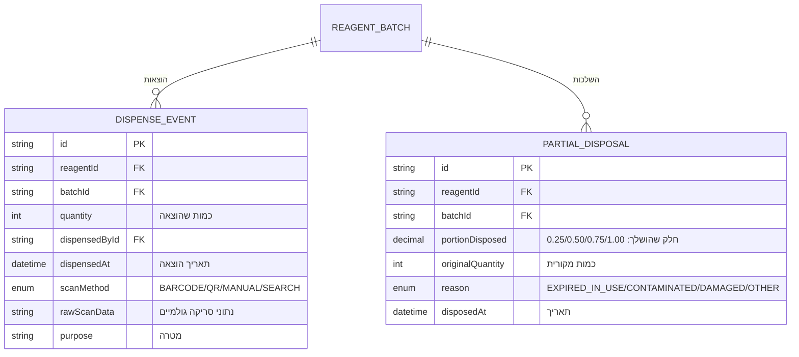

### 1.4 משלוחים יוצאים

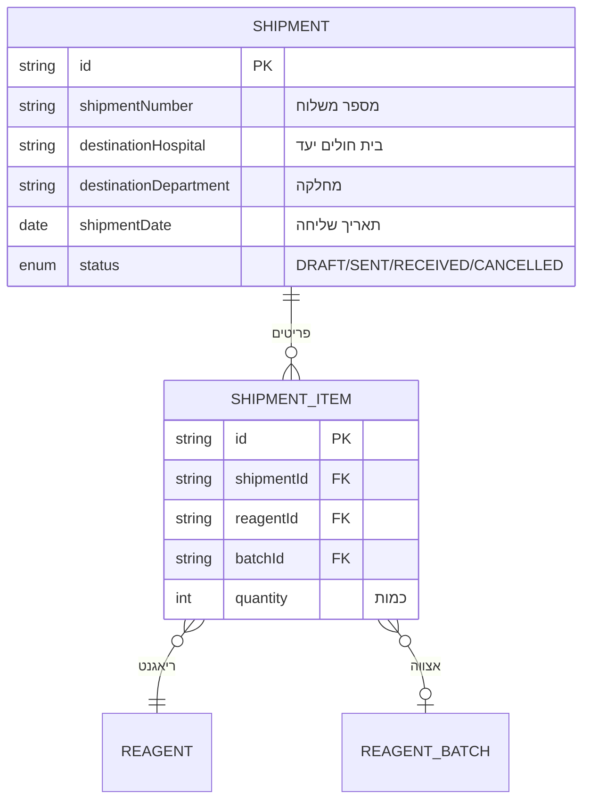

---

## 2. מחזור חיי אצווה

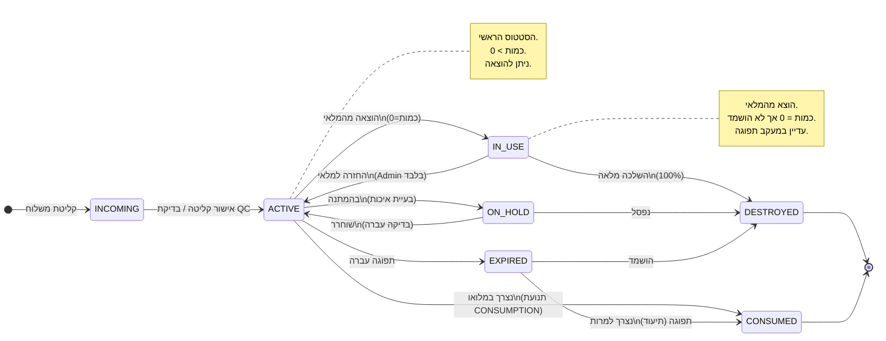

---

## 3. תהליך רכש — הזמנה מיידית

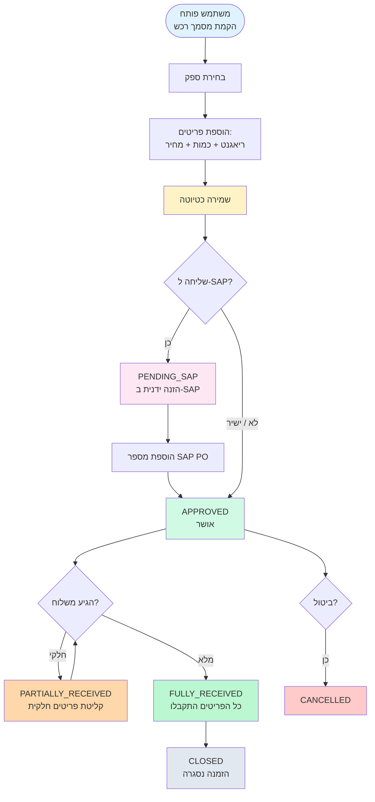

### סטטוסים:

| סטטוס | SAP מקביל | משמעות |
|--------|-----------|--------|
| `DRAFT` | דרישת רכש (ME51N) | טיוטה, ניתן לערוך |
| `PENDING_SAP` | ממתין ליצירת PO (ME21N) | הוזן ב-SAP, ממתין לאישור |
| `APPROVED` | הזמנת רכש מאושרת | מוכן לקליטה |
| `PARTIALLY_RECEIVED` | קבלה חלקית (MIGO) | חלק מהפריטים הגיעו |
| `FULLY_RECEIVED` | קבלה מלאה | כל הפריטים הגיעו |
| `CLOSED` | סגור | הזמנה הושלמה |
| `CANCELLED` | מבוטל | בוטל |

---

## 4. תהליך רכש — הזמנת מסגרת ובקשות משיכה

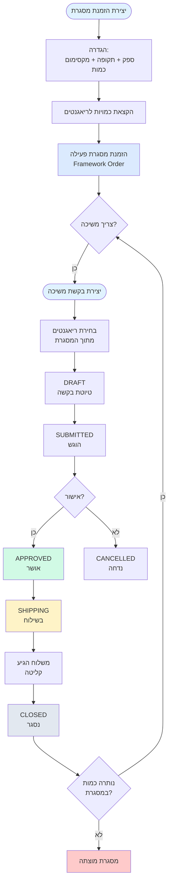

### נוסחה: כמות זמינה במסגרת

```
כמות_זמינה = מקסימום_כולל - סכום(כמות_מבוקשת בכל בקשות המשיכה הפעילות)
```

---

## 5. קליטת משלוח

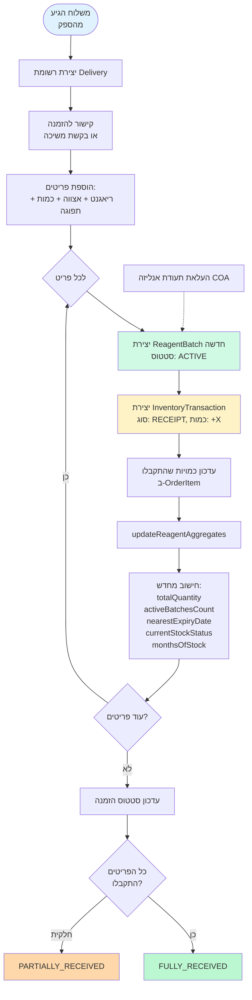

### תנועת מלאי שנוצרת:

| שדה | ערך |
|------|------|
| transactionType | `RECEIPT` |
| quantityDelta | `+כמות שהתקבלה` |
| sourceType | `order` |
| sourceId | `מזהה ההזמנה` |

---

## 6. הוצאה מהמלאי

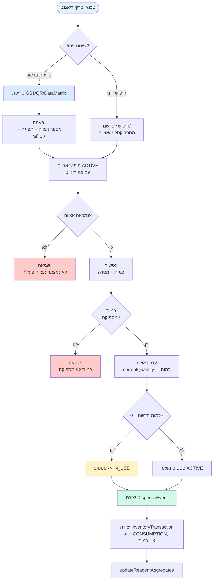

### לוגיקה:

```
כמות_חדשה = כמות_נוכחית - כמות_מוצאת

אם כמות_חדשה <= 0:
    סטטוס_אצווה = IN_USE    // הועבר לשימוש
אחרת:
    סטטוס_אצווה = ACTIVE    // עדיין זמין
```

---

## 7. פריטים בשימוש והשלכה חלקית

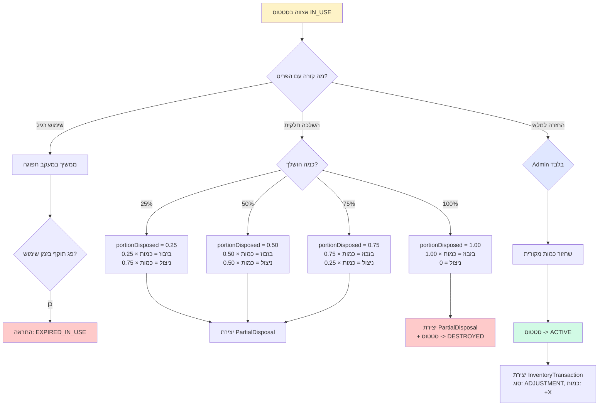

### נוסחת חישוב בזבוז:

```
בזבוז = כמות_מקורית × חלק_השלכה
ניצול_בפועל = כמות_מקורית - בזבוז
= כמות_מקורית × (1 - חלק_השלכה)
```

---

## 8. ספירת מלאי פיזית

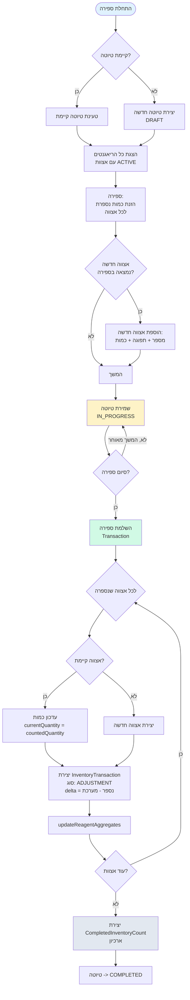

### לוגיקה:

```
לכל אצווה שנספרה:
    הפרש = כמות_נספרת - כמות_במערכת

    אם אצווה קיימת:
        עדכון currentQuantity = כמות_נספרת
        יצירת תנועה ADJUSTMENT עם delta = הפרש
    אם אצווה חדשה (+ תפוגה):
        יצירת אצווה חדשה עם כמות = כמות_נספרת
        יצירת תנועה ADJUSTMENT עם delta = כמות_נספרת
```

---

## 9. חישוב השלמות מלאי

```mermaid
flowchart TD
    A([חישוב השלמות]) --> B[טעינת כל הריאגנטים\nעם נתוני צריכה]

    B --> C{לכל ריאגנט}
    C --> D[צריכה = ידנית או ממוצעת]
    D --> E["מלאי_יעד = צריכה × חודשי_תכנון"]
    E --> F["מלאי_בטחון = צריכה × 0.5 (2 שבועות)"]
    F --> G["סה''כ_נדרש = מלאי_יעד + מלאי_בטחון"]

    G --> H[מלאי_נוכחי = totalQuantity]
    H --> I["במשלוח = כמויות מהזמנות\nמאושרות + בקשות משיכה"]
    I --> J["כמות_קרובת_תפוגה =\nאצוות שפגות תוך 30 יום"]

    J --> K["מלאי_נטו = נוכחי + במשלוח - קרוב_תפוגה"]
    K --> L["הצעה = max(0, סה''כ_נדרש - מלאי_נטו)"]

    L --> M{הצעה > 0?}
    M -- כן --> N[הוספה לרשימת\nהמלצות להשלמה]
    M -- לא --> O[לא נדרשת השלמה]

    N --> P{עוד ריאגנטים?}
    O --> P
    P -- כן --> C
    P -- לא --> Q[מיון לפי\nחודשי מלאי\n(נמוך ביותר ראשון)]

    Q --> R{פעולה}
    R -- יצירת הזמנה --> S[createAutomaticOrder\nקיבוץ לפי ספק]
    R -- משיכה ממסגרת --> T[createAutomaticWithdrawal\nנגד הזמנת מסגרת]

    style A fill:#e0f2fe
    style N fill:#fef3c7
    style S fill:#d1fae5
    style T fill:#d1fae5
```

### נוסחה מלאה:

```
צריכה_חודשית = manualMonthlyUsage (אם הוגדר) || averageMonthlyUsage

מלאי_יעד = צריכה_חודשית × חודשי_תכנון (ברירת מחדל: 3)
מלאי_בטחון = צריכה_חודשית × 0.5
סה''כ_נדרש = מלאי_יעד + מלאי_בטחון

מלאי_נטו = מלאי_נוכחי + כמות_בהזמנות_פתוחות - כמות_קרובת_תפוגה

הצעת_הזמנה = max(0, סה''כ_נדרש - מלאי_נטו)

חודשי_מלאי = מלאי_נוכחי / צריכה_חודשית
```

---

## 10. מנוע התראות

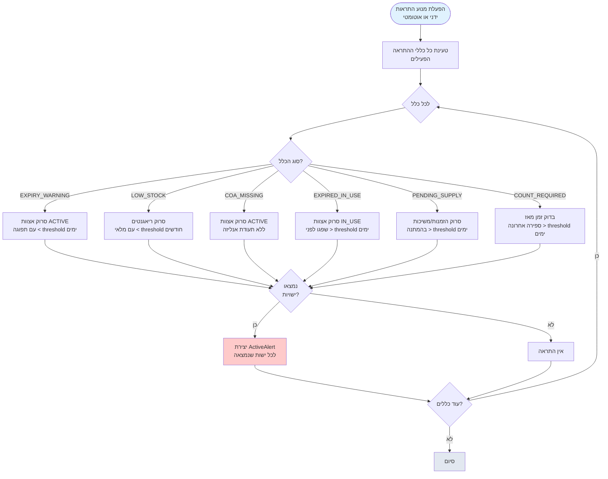

### חומרת התראה ומחזור חיים:

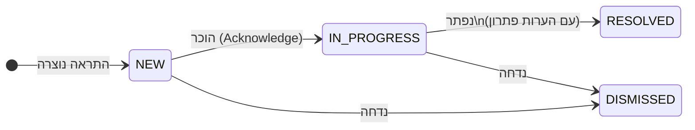

| חומרה | משמעות | דוגמה |
|--------|--------|--------|
| `CRITICAL` | דורש טיפול מיידי | ריאגנט פג תוקף היום |
| `HIGH` | דחוף | מלאי קריטי (< 1 חודש) |
| `MEDIUM` | לטיפול | מלאי נמוך (< 2 חודשים) |
| `LOW` | מידעי | חסר COA |

---

## 11. סטטוס מלאי ריאגנט

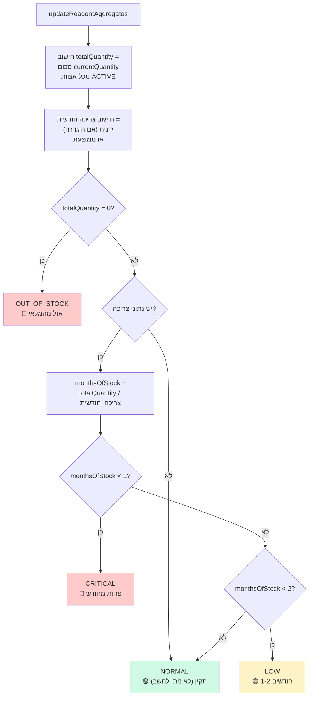

---

## 12. סקירת מסכים ופעולות

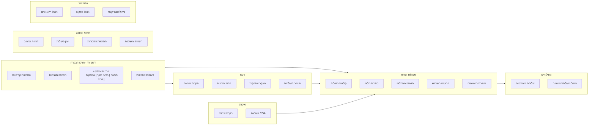

---

## 13. משלוחים יוצאים

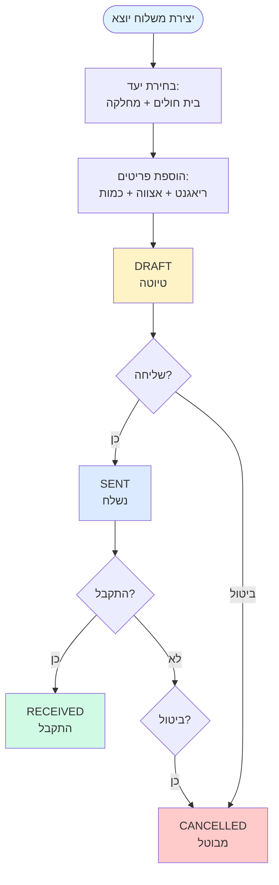

---

## 14. בקרת איכות

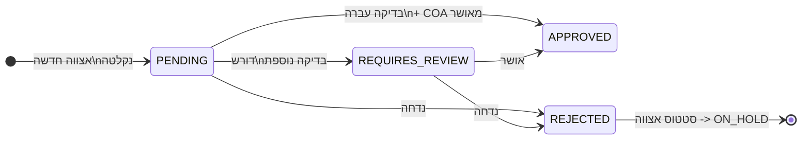

### פעולות QC לכל אצווה:

| פעולה | שדות מעודכנים |
|--------|---------------|
| עדכון סטטוס QC | `qcStatus` |
| העלאת תעודת אנליזה | `coaDocumentUrl` |
| עדכון תפוגה | `expiryDate` |
| עדכון כמות | `currentQuantity` |
| עדכון תאריך שימוש ראשון | `firstOpenedDate` |
| הוספת הערות QC | `qcNotes` |

---

## 15. סריקת ברקודים

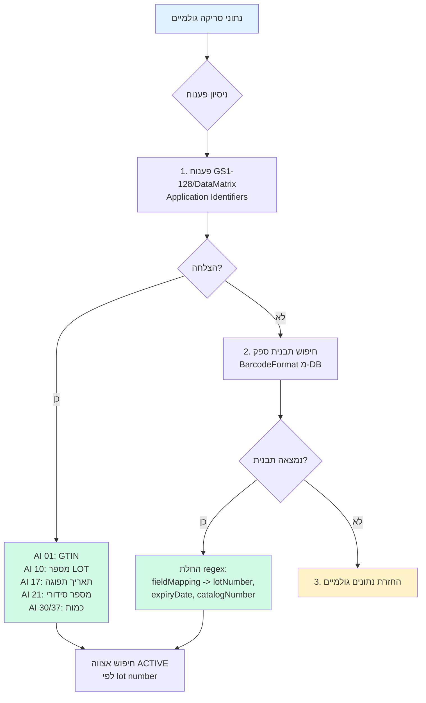

### תצורת ברקוד לכל ספק:

| שדה | תיאור | דוגמה |
|------|--------|--------|
| `barcodeType` | סוג ברקוד | CODE128, QR, GS1_128, DATAMATRIX |
| `parsePattern` | ביטוי רגולרי | `LOT:(\w+)\|EXP:(\d{6})` |
| `fieldMapping` | מיפוי שדות (JSON) | `{"lotNumber": 1, "expiryDate": 2}` |
| `dateFormat` | פורמט תאריך | `YYMMDD`, `YYYY-MM-DD` |

---

## 16. תנועות מלאי (Inventory Transactions)

כל שינוי במלאי מתועד כתנועה:

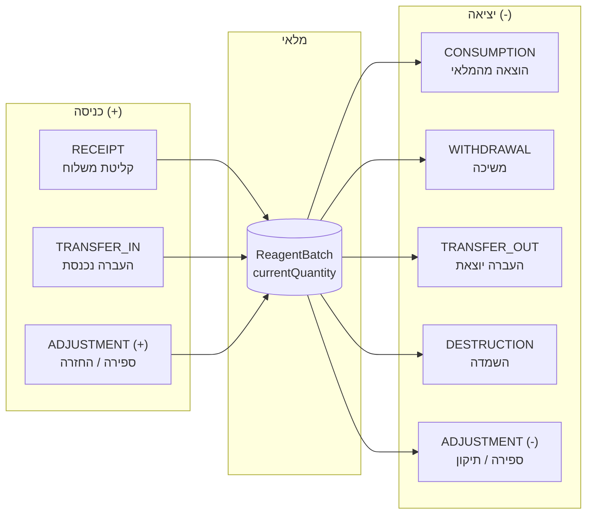

### טבלת סוגי תנועות:

| סוג תנועה | כיוון | מתי נוצר | SAP Movement Type |
|------------|--------|----------|-------------------|
| `RECEIPT` | +כמות | קליטת משלוח | 101 (GR against PO) |
| `CONSUMPTION` | -כמות | הוצאה מהמלאי (Dispense) | 261 (GI for consumption) |
| `WITHDRAWAL` | -כמות | משיכה מבקשת משיכה | 261 |
| `ADJUSTMENT` | +/- | ספירת מלאי / החזרה | 701/702 (PI differences) |
| `DESTRUCTION` | -כמות | השמדת פריט פגום/פג | 551 (Scrapping) |
| `TRANSFER_IN` | +כמות | העברה ממחסן אחר | 311 (Transfer posting) |
| `TRANSFER_OUT` | -כמות | שליחה לבית חולים | 311 (Transfer posting) |

---

## סיכום: מפת תהליכים מלאה

```mermaid
flowchart TB
    subgraph planning["📊 תכנון"]
        REPL[חישוב השלמות מלאי]
    end

    subgraph procure["🛒 רכש"]
        ORD[הזמנה מיידית]
        FRM[הזמנת מסגרת]
        WDR[בקשת משיכה]
    end

    subgraph receive["📦 קליטה"]
        DEL[קליטת משלוח]
        QC[בקרת איכות + COA]
    end

    subgraph storage["🏪 מלאי"]
        BAT[אצוות פעילות]
        CNT[ספירת מלאי]
        ALR[התראות]
    end

    subgraph usage["🔬 שימוש"]
        DIS[הוצאה / סריקה]
        INU[פריטים בשימוש]
        DSP[השלכה חלקית]
    end

    subgraph outgoing["🚚 משלוחים"]
        SHP[שליחה לבית חולים]
    end

    subgraph reporting_section["📈 דיווח"]
        RPT[דוחות]
        LOG[יומן פעילות]
    end

    REPL --> ORD
    REPL --> WDR
    FRM --> WDR
    ORD --> DEL
    WDR --> DEL
    DEL --> QC
    QC --> BAT
    BAT --> DIS
    DIS --> INU
    INU --> DSP
    BAT --> SHP
    BAT --> CNT
    BAT --> ALR
    ALR --> REPL
    BAT --> RPT
    DIS --> LOG
    DEL --> LOG
    CNT --> LOG
```
